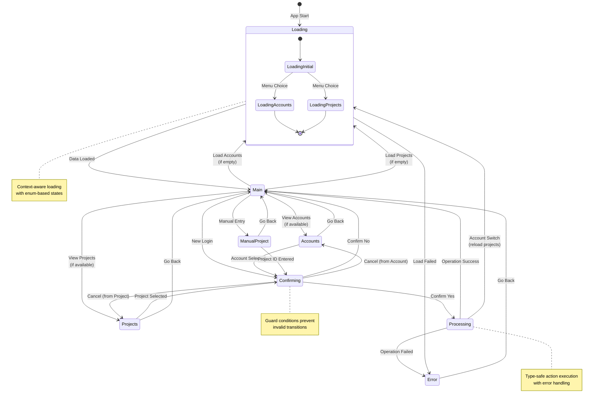

# GCP Switcher

A terminal user interface (TUI) for managing Google Cloud Platform accounts and projects.

## Features

- View and switch between GCP accounts
- View and switch between GCP projects
- Login to new GCP accounts
- Manual project ID entry
- Debug logging support
- Interactive UI with keyboard navigation
- Cross-platform support (Linux, Windows, macOS)
- **Enterprise-grade state management** with formal state machine validation

## Prerequisites

- Go 1.24 or later
- Google Cloud SDK (gcloud) installed and in PATH

### Dependencies

The application uses carefully selected, high-quality dependencies:

- **[Bubble Tea](https://github.com/charmbracelet/bubbletea)** v1.3.9 - TUI framework
- **[Lipgloss](https://github.com/charmbracelet/lipgloss)** v1.1.0 - Terminal styling
- **[Bubbles](https://github.com/charmbracelet/bubbles)** v0.21.0 - UI components
- **[Stateless](https://github.com/qmuntal/stateless)** v1.7.2 - State machine (Trust Score: 9.2)

## Installation

```bash
git clone https://github.com/mathd/gcp-switcher.git
cd gcp-switcher
make build  # Build for current platform
# or
make build-all  # Build for all platforms
```

The binaries will be created in the `bin` directory:
- Linux: `bin/gcp-switcher-linux-amd64`
- Windows: `bin/gcp-switcher-windows-amd64.exe`
- macOS Intel: `bin/gcp-switcher-darwin-amd64`
- macOS ARM: `bin/gcp-switcher-darwin-arm64`

## Usage

Run the application:

```bash
# On Unix-like systems (Linux/macOS)
./bin/gcp-switcher

# On Windows
.\bin\gcp-switcher.exe
```

With debug logging enabled:

```bash
# On Unix-like systems (Linux/macOS)
./bin/gcp-switcher --debug

# On Windows
.\bin\gcp-switcher.exe --debug
```

### Controls

- `↑/↓` or `j/k`: Navigate through options
- `Enter`: Select option
- `q`: Quit or go back
- `Ctrl+C`: Quit application

## State Machine Architecture

GCP Switcher uses a formal state machine implemented with the [`stateless`](https://github.com/qmuntal/stateless) library for robust state management. The application flow is visualized below:



### State Machine Features

- **🔒 Type Safety**: Enum-based states and triggers prevent runtime errors
- **🛡️ Guard Conditions**: Formal validation ensures only valid transitions
- **📊 Auto-Documentation**: Visual diagrams generated from state definitions
- **🧪 Comprehensive Testing**: All state transitions validated with unit tests
- **🐛 Enhanced Debugging**: Clear state transition logs and validation errors

### Key States

| State | Purpose | Triggers |
|-------|---------|----------|
| `Loading` | Initial data loading with context | `TriggerDataLoaded`, `TriggerError` |
| `Main` | Primary menu interface | `TriggerMenuChoice`, `TriggerLoad*` |
| `Accounts` | Account selection interface | `TriggerAccountSelected`, `TriggerGoBack` |
| `Projects` | Project selection interface | `TriggerProjectSelected`, `TriggerGoBack` |
| `Confirming` | User confirmation dialog | `TriggerConfirmYes`, `TriggerConfirmNo` |
| `Processing` | Operation execution | `TriggerOperationComplete`, `TriggerOperationFailed` |
| `ManualProject` | Manual project ID entry | `TriggerManualProjectEntry`, `TriggerGoBack` |
| `Error` | Error display and recovery | `TriggerGoBack` |

## Project Structure

```
.
├── cmd/
│   └── gcp/              # GCP command execution logic
├── internal/
│   ├── model.go          # Application data model and initialization
│   ├── statemachine.go   # Formal state machine implementation
│   ├── update.go         # Message handling and UI updates
│   ├── view.go           # UI rendering logic
│   └── statemachine_test.go  # State machine validation tests
├── types/                # Data structures and message types
├── ui/                   # UI styling and theme definitions
└── main.go              # Application entry point
```

### Architecture Highlights

- **🏗️ Clean Architecture**: Clear separation between UI, business logic, and state management
- **🔄 State Machine**: Professional state management with the `stateless` library
- **📡 Message-Driven**: Bubble Tea's message-passing architecture for reactive UI
- **🧪 Testable**: Isolated components with comprehensive test coverage
- **🎨 Styled**: Consistent UI styling with Lipgloss theme system

## Development

### Build Commands

```bash
# Build for current platform
make build

# Build for all platforms
make build-all

# Build for specific platforms
make build-linux
make build-windows
make build-mac

# Run the application
make run

# Run with debug logging
make run-debug

# Clean build artifacts
make clean

# Run tests
make test

# Format code
make fmt

# Run linter
make lint
```

For more commands, run:
```bash
make help
```

## License

See [LICENSE](LICENSE) file.